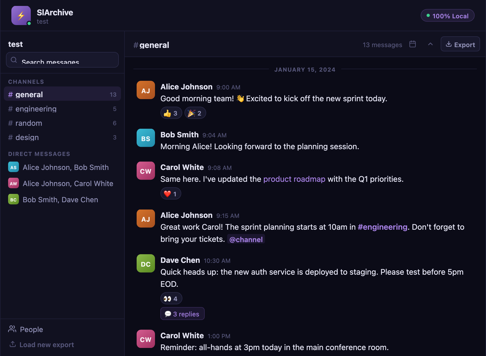

# SlArchive

Browse, search, and export your Slack workspace history. 100% local, nothing ever leaves your machine.

## How it works

Export your Slack workspace from Settings → Import/Export, drop the .zip file into SlArchive, and instantly browse everything — channels, DMs, threads, reactions, and file attachments. All processing happens locally in your browser.

## Features

- Full-text search
- Channels & Direct Messages
- Threads
- Reactions
- File & image attachments
- Jump to date
- People directory
- Keyboard navigation (↑↓ arrows, Enter, Escape)
- Export to HTML / Markdown / JSON
- Load new export without page refresh

## Privacy

All processing is local in the browser. The ZIP file never leaves your machine. No server, no accounts, no tracking, no analytics.

## Development

Run locally by opening `index.html` in any modern browser, or use `npx live-server` for auto-reload. No build tools or dependencies beyond JSZip (loaded from CDN).

## License

MIT

---

Built by [DevRelopers.io](https://devrelopers.io)
